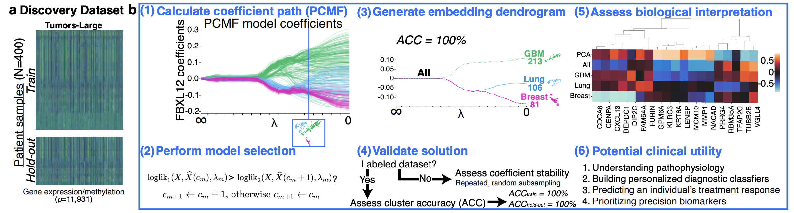

# Welcome to the CARVE Organization!

🏂 **CARVE<sup>TM</sup>** stands for **Cluster-Aware Routines for Versatile Embedding** and brings together software implementations of published cluster-aware embedding algorithms.

Stay tuned for future releases of new algorithms and an integrated toolbox: [Sign up here!](https://forms.gle/23DBTM6UiZemfvw98) 

---

## PCMF, LL-PCMF, & P3CA: Simple and Scalable Algorithms for Cluster‑Aware Embedding (Introduced in Buch, Liston, Grosenick. AISTATS 2024)

**PCMF** (Pathwise Clustered Matrix Factorization), **LL‑PCMF** (Locally Linear PCMF), **P3CA** (Pathwise Clustered Canonical Correlation Analysis), and **Consensus PCMF** are modular algorithms that combine low‑rank embedding with a convex clustering penalty to produce **cluster‑aware** low-rank representations for single‑view and two‑view data.

[AISTATS 2024 Repository with PCMF_P3CA package.](https://github.com/carve-ai/PCMF_P3CA)

These methods are introduced in:  
**Amanda M. Buch, Conor Liston, Logan Grosenick.** *Simple and scalable algorithms for cluster‑aware precision medicine.* AISTATS 2024 (PMLR 238:136–144).  
Paper: https://proceedings.mlr.press/v238/buch24a.html

The original algorithms and software were developed by Dr. Amanda Buch and Dr. Logan Grosenick.  
This release was refactored, prepared, and packaged by Dr. Buch for easy implementation, and replicates the software, algorithms, and results reported in the AISTATS 2024 paper.

Please contact Dr. Buch with any inquiries:
- amanda.m.buch@gmail.com
- amb2022@med.cornell.edu



---
## Citing
If you use the [PCMF_P3CA package](https://github.com/carve-ai/PCMF_P3CA), please cite:

> **Amanda M. Buch, Conor Liston, Logan Grosenick.**  
> *Simple and scalable algorithms for cluster‑aware precision medicine.*  
> AISTATS 2024, PMLR 238:136–144.  
> https://proceedings.mlr.press/v238/buch24a.html

```bibtex
@InProceedings{pmlr-v238-buch24a,
  title = {Simple and scalable algorithms for cluster-aware precision medicine},
  author = {Buch, Amanda M. and Liston, Conor and Grosenick, Logan},
  booktitle = {Proceedings of The 27th International Conference on Artificial Intelligence and Statistics},
  pages = {136--144},
  year = {2024},
  editor = {Dasgupta, Sanjoy and Mandt, Stephan and Li, Yingzhen},
  volume = {238},
  series = {Proceedings of Machine Learning Research},
  publisher = {PMLR},
  url = {https://proceedings.mlr.press/v238/buch24a.html}
}
```
